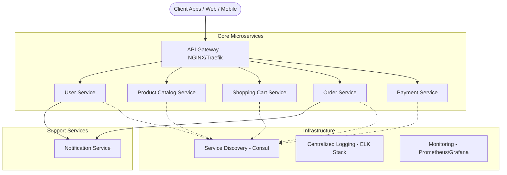

# Lumina: Scalable Microservices E-commerce Platform

Lumina is a production-grade, highly scalable e-commerce platform built with a microservices architecture. Designed for performance, reliability, and independent scalability, Lumina leverages containerization and modern orchestration tools to handle complex retail workflows.

---

## 🚀 Architecture Overview

Lumina is built on a **Microservices Architecture**, where each core functionality is decoupled into an independent service. Communication is handled via RESTful APIs and gRPC, managed by a central API Gateway.



---

## 🛠️ Core Microservices

### 👤 User Service
- **Responsibility:** User registration, authentication (JWT/OAuth2), and profile management.
- **Tech:** Node.js / Go, PostgreSQL/MongoDB.

### 📦 Product Catalog Service
- **Responsibility:** Manages product listings, categories, inventory levels, and search.
- **Tech:** Elasticsearch for search, Redis for caching.

### 🛒 Shopping Cart Service
- **Responsibility:** Persistent and temporary shopping carts, item quantity updates.
- **Tech:** Redis for high-speed state management.

### 📑 Order Service
- **Responsibility:** Order placement logic, status tracking, and order history.
- **Teck:** Kafka/RabbitMQ for asynchronous order processing.

### 💳 Payment Service
- **Responsibility:** Secure transaction handling via Stripe and PayPal integrations.
- **Security:** PCI-DSS compliant workflows.

### 🔔 Notification Service
- **Responsibility:** Real-time email and SMS updates (Order confirmation, shipping).
- **Integrations:** SendGrid (Email), Twilio (SMS).

---

## 🏗️ Infrastructure & Additional Components

| Component | Technology | Purpose |
| :--- | :--- | :--- |
| **API Gateway** | Kong / Traefik | Unified entry point, Rate limiting, Auth offloading. |
| **Service Discovery** | Consul | Dynamic service registration and health checking. |
| **Centralized Logging** | ELK Stack | Aggregated logs for cross-service debugging. |
| **Containerization** | Docker | Consistent environments across Dev, Staging, and Prod. |
| **Orchestration** | Kubernetes | Automated deployment, scaling, and management. |
| **CI/CD** | GitHub Actions | Automated build, test, and deployment pipelines. |

---

## 🏁 Getting Started

### Prerequisites
- [Docker](https://www.docker.com/get-started) & [Docker Compose](https://docs.docker.com/compose/install/)
- [Node.js](https://nodejs.org/) (for local development)
- [Kubernetes / Minikube](https://minikube.sigs.k8s.io/docs/start/) (optional for orchestration)

### Installation
1. **Clone the repository:**
   ```bash
   git clone https://github.com/Simply-Incognito/Lumina.git
   cd Lumina
   ```

2. **Spin up the infrastructure:**
   ```bash
   docker-compose up -d
   ```

3. **Verify services:**
   Access the API Gateway at `http://localhost:8080` to see the health status of all microservices.

---

## 🗺️ Roadmap

- [ ] **Phase 1:** MVP Microservices (User, Product, Cart).
- [ ] **Phase 2:** Order & Payment integration with external gateways.
- [ ] **Phase 3:** Implementation of API Gateway and Service Discovery.
- [ ] **Phase 4:** Centralized Logging & Monitoring setup.
- [ ] **Phase 5:** Production deployment on Kubernetes with CI/CD.

---

## 🤝 Contributing
Contributions are welcome! Please read the [Contributing Guide](CONTRIBUTING.md) before submitting pull requests.

## 📄 License
This project is licensed under the MIT License - see the [LICENSE](LICENSE) file for details.
